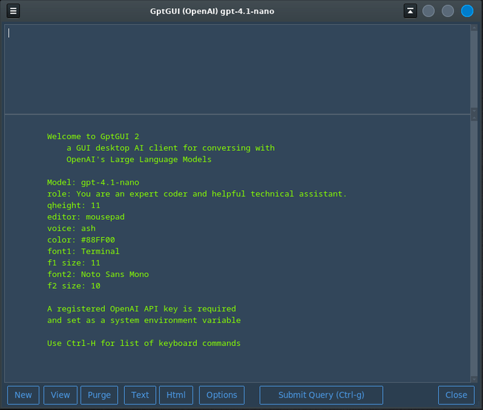

# GptGUI
_Python GUI for Linux or Windows to access OpenAI Gpt Engine._

## Instalation

For windows you can downolad the _setup\_GptGUI.exe_ file supplied with this repo.

For Linux / Mac you can either _gh repo clone MLeidel/GptGUI_ or download a zip
file of this repo.


Before using this application Python 3.x must be installed.

To install Python go to https://www.python.org/downloads/.  
Click __Download Python 3.???__ and follow the installation instructions.

Use the requirements.txt file to install any modules you may be missing.
```bash
    pip3 install -r requirements.txt
```


> ___
You will also have to Sign Up at https://openai.com/api/ and __create
an API Key__.  
There is no cost to do so.
___

After starting the app the first time click the _Options_
button.

Copy and past your API key into the "Gpt Key" entry box.  
A better way to handle your API key is to set it up as a System Environment Variable.  
Then put the variable's name into the "Gpt Key" entry box.

Change any other appearance or Gpt options as well.  
Then click the _Save & Close_ button.


---

## A few more notes

---

### gptgui.ini

The options are stored in a plain text file called _gptgui.ini_.  
If you prefer you could change the settings with a text editor.

The height of the query text area (top frame) can be lengthened
or shortened by accessing the right-click menu.

---

### Using



Input your query in the top box, and hit __"Submit Query"__ or _Ctrl-g_.  
The Gpt AI response will appear in the larger box below.

The buttons:
- Clear
> Clears the query (top frame) and the response area (bottom frame).
- Save
> Save the response from Gpt, with the query, into your _save_ file
that you set up in gptgui.ini. Also you can turn on _Auto Save_ in
the options which automatically saves each query/response.
- View
> Displays the _save_ file you set up in Options (gptgui.ini).
- Purge
> Clears the contens of the _save_ file.
- Options
> launches the Options editor program.
- Close
> Exit the program. _Ctrl-q_ exits the program quickly.

---

## Hot Keys


----
END
